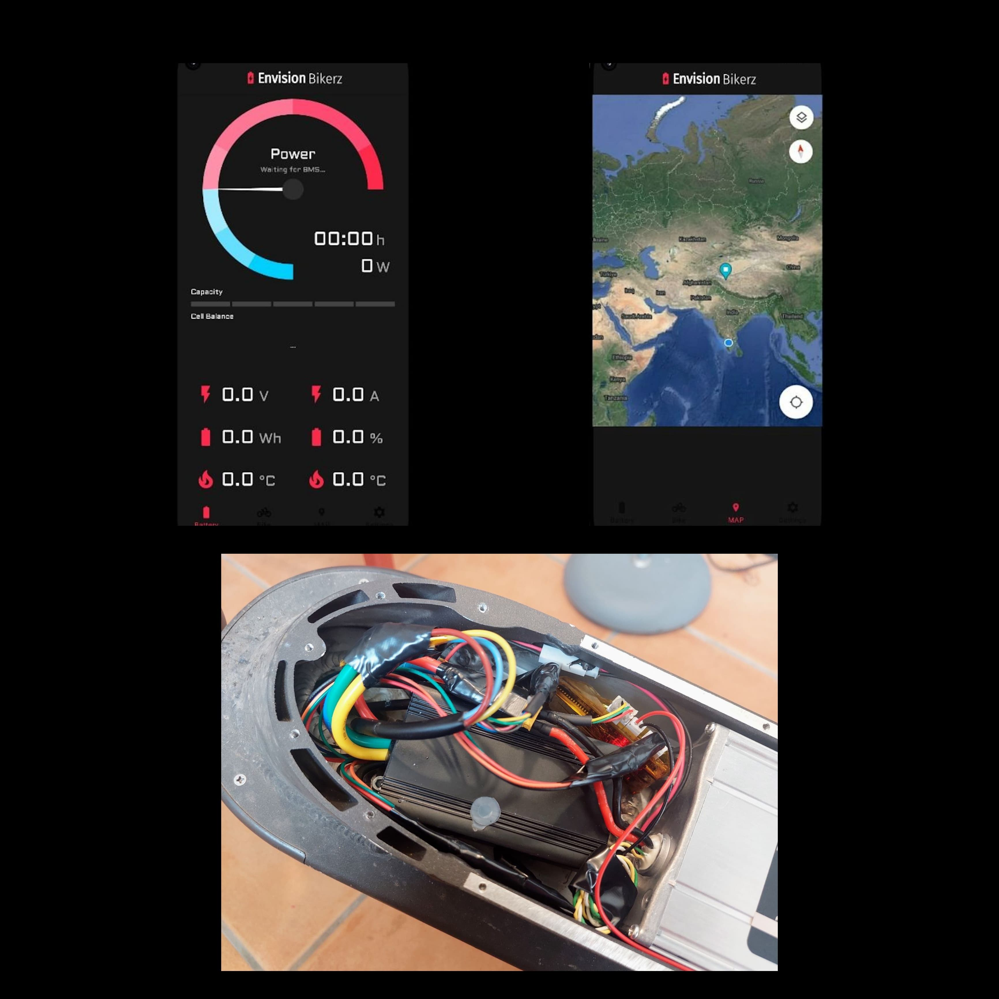

# E-Bike Speed & Location Tracker

Welcome to the E-Bike Monitor Android application repository! This app provides real-time speed and location tracking for e-bike enthusiasts, utilizing the Android Studio development environment and integrating the Global Positioning System (GPS) and Google Maps APIs.

## Features

- **Real-time Tracking**: Utilizes GPS and Google Maps APIs to track the location of the e-bike in real-time.
  
- **Speed Monitoring**: Utilizes sensors on the e-bike to monitor speed and displays it in real-time on the user interface.
  
- **User-friendly Interface**: Features an intuitive user interface with easy-to-use controls and features, making it simple for users to track their e-bike rides.

- **Safety Features**: Allows users to share their location with friends or family members in case of an emergency, enhancing safety while riding.

## Screenshots and Demo

<div align="center">
  
</div>

## Tech Stack

- Android Studio
- Java/Kotlin
- GPS and Google Maps APIs
- Sensors integration for speed monitoring

## Getting Started

To get started with this project, follow these steps:

1. Clone the repository:

   ```
   git clone https://github.com/your-username/e-bike-monitor-android.git
   ```

2. Open the project in Android Studio.

3. Ensure you have the necessary API keys for Google Maps and any other required services.

4. Customize the UI/UX to match your app's branding and requirements.

5. Test the application on various Android devices to ensure compatibility.

6. Deploy the application to the Google Play Store or distribute it through other channels.

## Future Enhancements

The E-Bike Monitor application has the potential for further development with additional features such as:

- Distance tracking
- Calories burned calculation
- Integration with social platforms for sharing rides
- Route planning and navigation

## Contributing

Contributions are welcome! If you'd like to contribute to this project, please follow these steps:

1. Fork the repository.
2. Create a new branch (`git checkout -b feature/new-feature`).
3. Make your changes and commit them (`git commit -am 'Add new feature'`).
4. Push to the branch (`git push origin feature/new-feature`).
5. Create a new Pull Request.


---

### 🚀 Maintained by [Sanjay A R](https://github.com/sanjay-ar)

[](https://portfolio-ar.vercel.app/)  
[](https://www.linkedin.com/in/sanjay-ar/)  
[](https://github.com/sanjay-ar)

> 💡 *Like this project? Leave a ⭐ and connect with me!*

